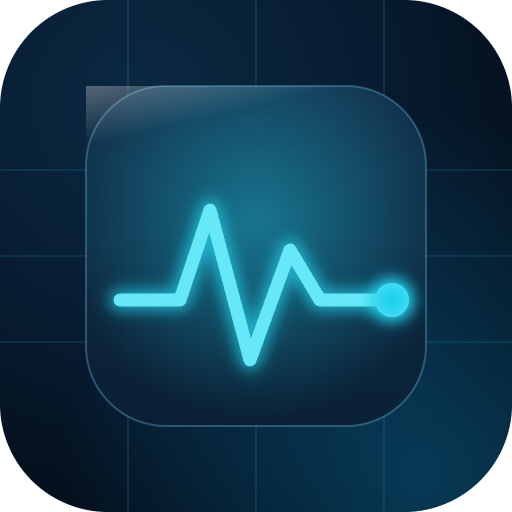

  

<h1 align="center">台灣即時 · TW Live</h1>

台灣政府開放資料的即時戰情室 — Taiwan government open data, live.

  <a href="#english">English</a> · <a href="#繁體中文">繁體中文</a>

  🔗 <b>Live:</b> <a href="https://live.kvcc.me">live.kvcc.me</a>

---

## English

A real-time dashboard that aggregates **11 streams** of Taiwan's government open data into one console — water, weather, air, earthquakes, transit, power and more. Each domain is a card/map dashboard with a clean radial gauge; refined Linear-inspired dark UI, light / dark / auto themes, bilingual (中 / EN).

### Features
- **11 live sources** across 7 categories (water · weather · environment · hazard · mobility · energy · life).
- **Grid + map views** per source, with a detail panel; markers and gauges are tier-coloured.
- **Near me** — opt-in geolocation sorts any source by distance and shows how far each station is.
- **Fuzzy search** — token, case-insensitive matching across names, areas and addresses.
- **Deep links** — category, view, search and sort all live in the URL (`/water?view=map`).
- **Built to grow** — a new source is one config object + one Worker adapter.

### Tech
- **Frontend** — Vite + React 19 + Tailwind CSS v4, React Query, React Router, Leaflet. Deployed on Vercel (`live.kvcc.me`).
- **Data proxy** — a Cloudflare Worker (`live-api.kvcc.me`) that holds API keys, normalizes each source into a common shape, adds CORS, and edge-caches via the Cache API (with a 24h stale fallback for flaky upstreams). Zero KV writes.
- **Source abstraction** — every source is a config in `src/lib/sources/`; generic components (gauge, card, map, search) are driven entirely off it.

### Data sources
| Category | Sources | Provider |
|----------|---------|----------|
| 水情 Water | Reservoirs · River levels | WRA |
| 氣象 Weather | Temperature · Rainfall · UV index | CWA |
| 環境 Environment | Air quality (AQI) | MOENV |
| 防災 Hazard | Earthquakes | CWA |
| 交通 Mobility | YouBike · Parking | YouBike / TDX |
| 能源 Energy | Power reserve | Taipower |
| 生活 Life | Fuel prices | CPC |

Most sources are keyless or use the public demo keys published on data.gov.tw; CWA/MOENV/TDX private keys can be supplied as Worker secrets.

### Credit
Open data © their respective agencies via Taiwan's open data platform. Built by kv.

---

## 繁體中文

把台灣政府公開的 **11 種即時資料** 匯集成一個戰情室——水情、氣象、空品、地震、交通、能源……。每個領域都是卡片／地圖儀表板，搭配乾淨的環形量表；Linear 風精緻暗色介面，支援淺色 / 深色 / 自動主題與中英雙語。

### 功能
- **11 個即時資料源**，分 7 類（水情・氣象・環境・防災・交通・能源・生活）。
- 每個源都有 **列表 + 地圖** 視圖與詳情面板；標記與量表依等級上色。
- **附近** — 授權定位後可依距離排序任一資料源，並顯示各測站離你多遠。
- **模糊搜尋** — 不分大小寫的分詞比對，涵蓋名稱、區域、地址。
- **深連結** — 分類、視圖、搜尋、排序全寫進網址（`/water?view=map`）。
- **可擴充** — 新增一個資料源 = 一份 config + 一個 Worker adapter。

### 技術
- **前端** — Vite + React 19 + Tailwind CSS v4、React Query、React Router、Leaflet，部署於 Vercel（`live.kvcc.me`）。
- **資料代理** — Cloudflare Worker（`live-api.kvcc.me`）：藏 API key、把各來源正規化成共用形狀、處理 CORS、用 Cache API 邊緣快取（上游抽風時回退 24h 舊資料）。零 KV 寫入。
- **資料源抽象** — 每個源是 `src/lib/sources/` 的一份 config，通用元件（量表/卡片/地圖/搜尋）全由它驅動。

### 資料來源
| 分類 | 資料源 | 提供者 |
|------|--------|--------|
| 水情 | 水庫水位・河川水位 | 水利署 |
| 氣象 | 氣溫・雨量・紫外線 | 中央氣象署 |
| 環境 | 空氣品質 AQI | 環境部 |
| 防災 | 地震 | 中央氣象署 |
| 交通 | YouBike・停車場 | YouBike／TDX |
| 能源 | 電力備轉容量 | 台電 |
| 生活 | 油價 | 中油 |

多數來源免金鑰、或使用 data.gov.tw 公開的示範金鑰；CWA／MOENV／TDX 私有金鑰可設為 Worker secret。

### 致謝
開放資料著作權屬各主管機關（經由政府資料開放平臺）。Built by kv.
